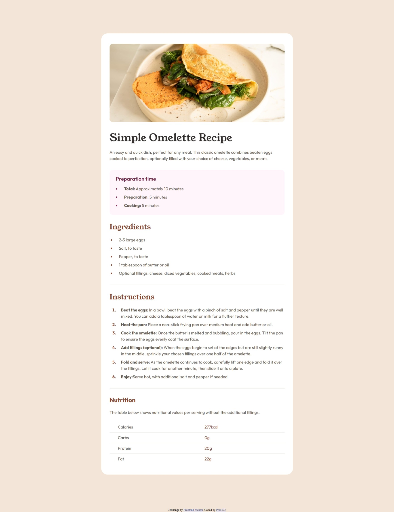
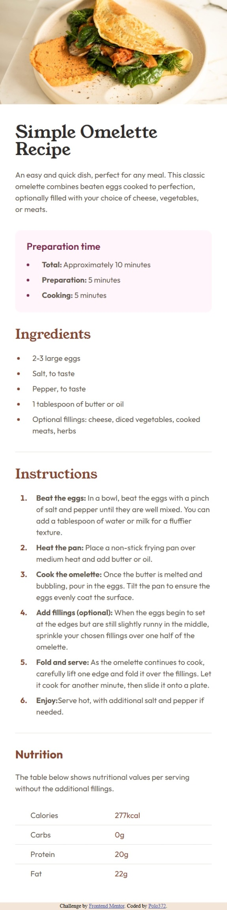

# Frontend Mentor - Recipe page solution

This is a solution to the [Recipe page challenge on Frontend Mentor](https://www.frontendmentor.io/challenges/recipe-page-KiTsR8QQKm). Frontend Mentor challenges help you improve your coding skills by building realistic projects. 

## Table of contents

- [Overview](#overview)
  - [The challenge](#the-challenge)
  - [Screenshot](#screenshot)
  - [Links](#links)
- [My process](#my-process)
  - [Built with](#built-with)
  - [What I learned](#what-i-learned)
  - [Continued development](#continued-development)
  - [AI Collaboration](#ai-collaboration)
- [Author](#author)
- [Acknowledgments](#acknowledgments)

## Overview

### Screenshot




### Links

- Solution URL: [Solution URL here](https://github.com/polo372/recipe-page-main)
- Live Site URL: [Live site URL here](https://recipe-challeng.netlify.app/)

## My process

### Built with

- Semantic HTML5 markup
- CSS custom properties
- Flexbox
- Mobile-first workflow

### What I learned

I learned to cible the child element

```css
.ol_instructions >li:nth-child(-n + 5),
.ul_preparation >li:nth-child( -n + 2),
.ul_ingredients > li:nth-child( -n + 4){
    margin-bottom: var(--space_100);
}
```

### Continued development

I need to continue learn about responsive design

### AI Collaboration

I use claude with the A.I instruction to help me to finish this design with responsive detail like the main and .container width and the alignment of the nutrition table.

## Author

- Website - [Polo372](https://github.com/polo372)
- Frontend Mentor - [@polo372](https://www.frontendmentor.io/profile/polo372)
- Twitter - [@plbd372](https://x.com/plbd372)

## Acknowledgments

Thank's frontendmentor, this challenge was really hard to me.
